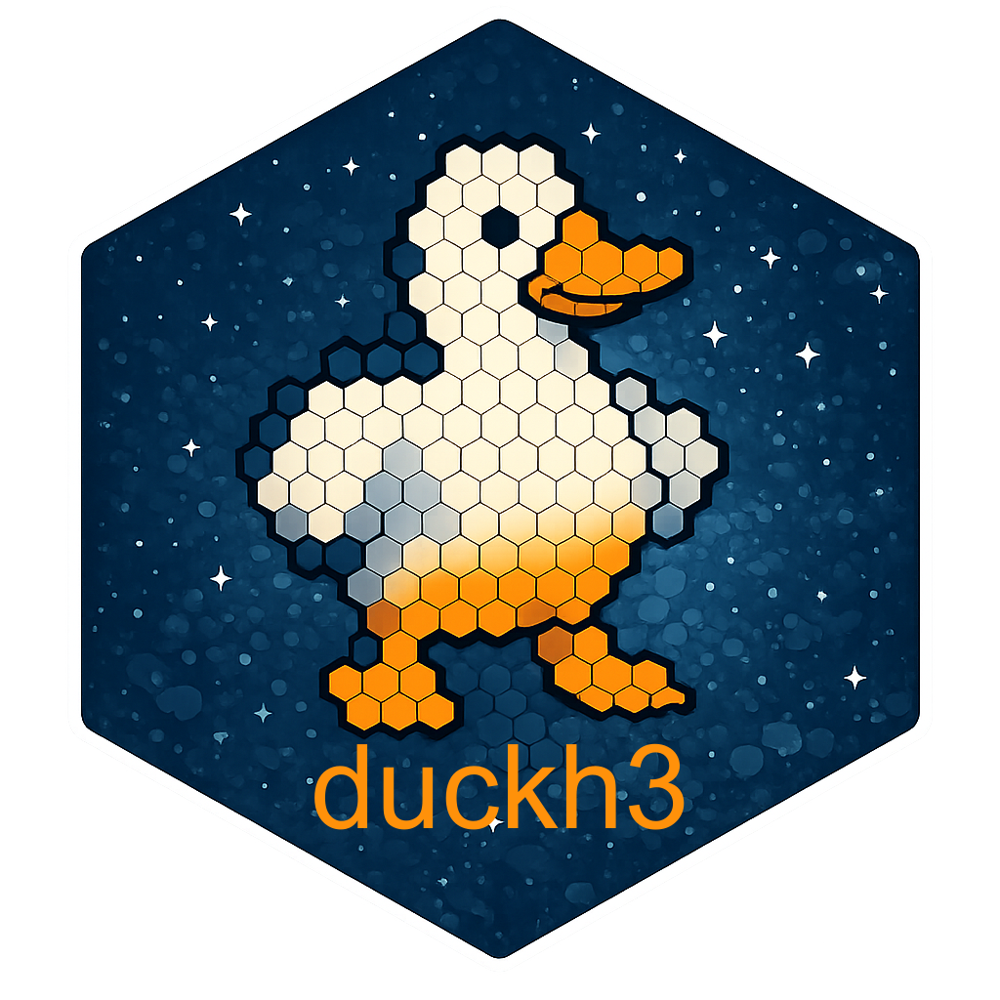

<!-- README.md is generated from README.Rmd. Please edit that file -->
```{r, include = FALSE}
knitr::opts_chunk$set(
  collapse = TRUE,
  comment = "#>",
  fig.path = "man/figures/README-",
  out.width = "100%"
)
```

# duckh3 <a href="https://cidree.github.io/duckh3/"></a>

<!-- badges: start -->

[](https://CRAN.R-project.org/package=duckh3) [](https://lifecycle.r-lib.org/articles/stages.html#experimental) [](https://app.codecov.io/gh/Cidree/duckh3) [](https://www.gnu.org/licenses/gpl-3.0) [](https://www.repostatus.org/#active) [](https://github.com/Cidree/duckh3/actions)

<!-- badges: end -->

**{duckh3}** provides fast, memory-efficient functions for analysing and manipulating large spatial and non-spatial datasets using the [H3 hierarchical indexing system](https://h3geo.org/) in R. It bridges [DuckDB's H3 extension](https://duckdb.org/community_extensions/extensions/h3) with R's data and spatial ecosystems — in particular **{duckspatial}**, **{dplyr}**, and **{sf}** — so you can leverage DuckDB's analytical power without leaving your familiar R workflow.

### How it works

{duckh3} was built around the same API as the [duckspatial R package](https://github.com/Cidree/duckspatial), and it operates on regular R data frames, `tibble`s, `dbplyr` lazy tables, and `duckspatial_df` objects. Unlike purely spatial workflows, H3 operations do not require your data to be spatial. Any table with longitude/latitude columns, or an existing H3 index column, is a valid starting point.

When a DuckDB connection is used, all H3 operations run inside that connection with the H3 extension enabled, letting DuckDB apply its own query optimisations before any data reaches R. Results are returned lazily and only materialised when you explicitly collect them.

In addition, {duckh3} registers a set of **DuckDB macros** on the default connection at load time, making H3 functions available directly inside `dplyr::mutate()` on lazy tables — no wrapper function needed. Note that they **only work with lazy tables**, not with regular data frames.

### Naming conventions

All functions follow the `ddbh3_*()` prefix (*DuckDB H3*), structured around the expected input data, and what they will be converted to:

- `ddbh3_lonlat_to_*()` — from longitude/latitude coordinates to H3 representations
- `ddbh3_points_to_*()` — from spatial point geometries to H3 representations
- `ddbh3_h3_to_*()` — convert H3 cells to other representations
- `ddbh3_vertex_to_*()` — convert H3 vertexes to other representations

With the following available transformations:

| Function family       | Output                              |
|-----------------------|-------------------------------------|
| `*_to_h3()`           | H3 index as string or `UBIGINT`     |
| `*_to_spatial()`      | H3 cell as spatial hexagon polygon  |
| `*_to_lon()`          | Longitude of H3 cell centroid       |
| `*_to_lat()`          | Latitude of H3 cell centroid        |

And there are also a set of function to retrieve or check properties of the data:

- `ddbh3_get_*()` — retrieve H3 cell properties (resolution, parent, children, vertices...)
- `ddbh3_is_*()` — check properties of H3 indexes (valid, pentagon, Class III...)


## Installation


Install the stable release from CRAN:

```r
pak::pak("duckh3")
```

Install the latest GitHub version (more features, fewer accumulated bugs):

``` r
# install.packages("pak")
pak::pak("Cidree/duckh3")
```

Install the development version (may be unstable):
``` r
pak::pak("Cidree/duckh3@dev")
```

## Contributing

Bug reports, feature requests, and pull requests are very welcome!

-   [Raise an issue](https://github.com/Cidree/duckh3/issues)
-   [Open a pull request](https://github.com/Cidree/duckh3/pulls)